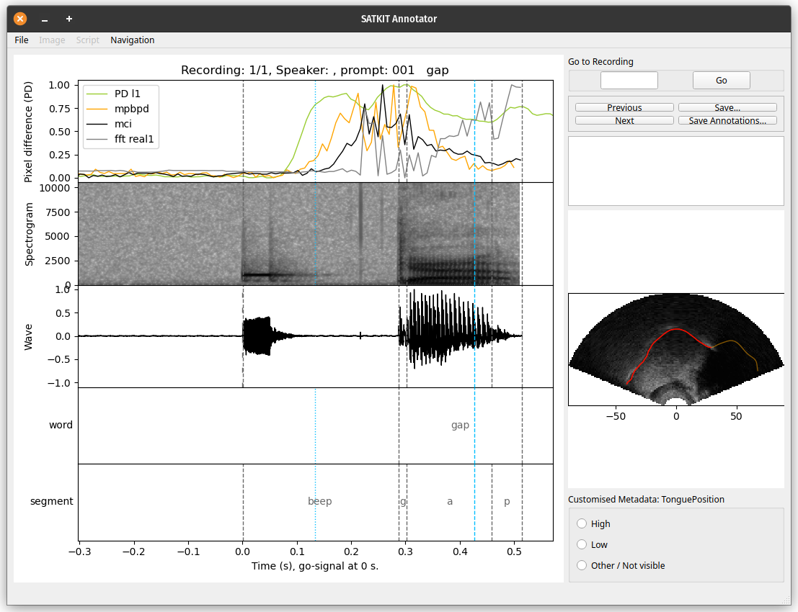

# Speech Articulation ToolKIT - SATKIT

**Please note that this is a fork of the original SATKIT.**

**Unless Pertti told you to use this repository, you should be using
[the official one](https://github.com/giuthas/satkit) instead.**



Tools for processing speech data. While currently these tools mainly work on
tongue and larynx ultrasound as well as audio, in the future, the toolkit will
include facilities for processing other kinds of articulatory data. The first
two tools to be implemented are Optical Flow and Pixel Difference.

Optical Flow tracks local changes in ultrasound frames and estimates
the flow field based on these.

Pixel Difference and Scanline Based Pixel Difference -- work on raw,
uninterpolated data and produce measures of change over the course of a
recording. How they work is explained in Chapter 3 of Pertti Palo's [PhD
thesis](https://eresearch.qmu.ac.uk/handle/20.500.12289/10163).

## Major update -- version 1.0 -- coming up

There will be incremental 0.x releases until the codebase reaches milestones for
version 1.0 (See [Roadmap](docs/Roadmap.markdown)). While this notice is here in
the main branch, that update is not yet complete. In the meanwhile, if you wish
to try SATKIT or contribute to the code or as an alpha/beta tester, please
contact Pertti for instructions.

2024-11-11: As the timeline has drawn out quite a bit from the originally
intended, time for a timeline update. Original plan for 1.0 was 2020 (yes 2020),
and later 2021 and 2023. Good ideas piled and work for various conferences also
piled, and it soon made no sense to not do a proper overhaul of the plan.
Current plan does not have a specific time for when 1.0 should be released, but
it does have a limited (if a bit lengthy) feature set. These will be rolled out
in about 10-15 minor releases (versions 0.11-0.21/0.26), which will be followed
by 1.0-alpha, 1.0-beta, 1.0-release-candidate, and 1.0.

## Current version

See [Changelog](docs/Changelog.markdown), for what's new in the current version.

## Getting Started

NOTE: 
- With version 1.0 getting closer a lot of the instructions below are
  outdated. More up-to-date information can be found in the
  [Documentation](https://giuthas.github.io/satkit/). See
  [Roadmap](docs/Roadmap.markdown) for updates on progress towards 1.0.
- There will also soon be a move to either pixi or uv for package, environment
  and installation management. This will make a lot of the below automated and
  easier.

Download the repository to either a subdirectory of the project you
want to use the tools on or a suitable place that you then add to your
$PYTHONPATH.

### Requisites

See the `.yml` files in `environments/` for a more list. Before 1.0 only the
satkit-devel environment is maintained, so read that one.

### Installing for regular use

An installation through pypi is in the works. Do get in touch if you would like
to *test* it. Do also get in touch if you would like to *build* it.

A downloadable executable will hopefully also become reality. Do get in touch if
you would like to *develop* it.

### Installing for development

To install all of the above and create a conda environment to run SATKIT in
first install anaconda from the link above. Then install mamba because anaconda
is unlikely to solve the dependencies correctly. Do this on the command line
with: `conda install mamba -n base -c conda-forge`

After you've (possibly forked and) cloned the repository from github with your
favourite git tool, cd into the repository root. There you should find the file
called `satkit_devel_conda_env.yaml` and `satkit_stable_conda_env.yaml`.

#### Using SATKIT as a library in program development

If you are not going to work on SATKIT itself, you should setup the stable
environment. To install the required packages and create the environment, run:
`mamba env create -f satkit_stable_conda_env.yaml`

Activate the environment with `conda activate satkit-stable` and the basics are
set up. If you want to have an editable install (changing code in the repo
changes behaviour of the installed SATKIT immediately) run finally `pip install
-e .` or `python3 -m pip install --editable .` if you prefer being explicit.

#### Working on SATKIT

If you plan on working on SATKIT, run the commands
`mamba env create -f satkit_devel_conda_env.yaml` and
`conda activate satkit-devel` instead of the ones above.

### What's included

See
[MANIFEST.markdown](https://github.com/giuthas/satkit/blob/master/MANIFEST.markdown)
for a description of the contents.

### Running the examples

There are three small datasets included in the distribution. You can
run tests on them with the test script `pd_test.py`. Currently the
following work and produce a new spaghetti_plot.pdf and a transcript
in `[method_name].log`.

``` shell
python satkit.py tongue_data_1_1
```

The first example directory contains recordings with all files present
while the second is intentionally missing some files. The latter case
should therefore produce warnings in the resulting log. Running
without the exclusion list specified should produce a plot with a
couple more curves in it.

The routines to deal with a directory structure like that of `test2`
are yet to be implemented.

## Running the tests

Proper testing is yet to be implemented.

## Contributing

Please, read the docs and get in touch with [Pertti](https://taurlin.org), if
you would like to contribute to the project.

## Versioning

We use [SemVer](http://semver.org/) for versioning under the rules as
set out by [PEP 440](https://www.python.org/dev/peps/pep-0440/) with
the additional understanding that releases before 1.0 (i.e. current
releases at time of writing) have not been tested in any way.

For the versions available, see the [tags on this
repository](https://github.com/giuthas/satkit/tags).

## Authors

* **Pertti Palo** - *The core of SATKIT* - [giuthas](https://github.com/giuthas)
* **Scott Moisik** - *Optic flow* - [ScottMoisik](https://github.com/ScottMoisik)
* **Matthew Faytak** - *Dimensionaliity reduction with PCA and LDA*
  [mfaytak](https://github.com/mfaytak)
* **Motoki Saito** - *Producing interpolated ultrasound images from raw data*
  [msaito8623](https://github.com/msaito8623)

List of [contributors](https://github.com/your/project/CONTRIBUTORS.markdown)
will be updated once there are more people working on this project.

## Copyright and License

The Speech Articulation ToolKIT (SATKIT for short) and examples is a
tool box for analysing articulatory data.

SATKIT Copyright (C) 2019-2023 Pertti Palo, Scott Moisik, Matthew
Faytak and Motoki Saito.

Optical Flow tools Copyright (C) 2020-2023 Scott Moisik

Pixel Difference tools Copyright (C) 2019-2023 Pertti Palo

Laryngeal example data Copyright (C) 2020 Scott Moisik

Tongue and tongue spline example data Copyright (C) 2013-2020 Pertti Palo

### Program license

SATKIT is licensed under [GPL 3.0](https://github.com/giuthas/satkit/blob/master/LICENSE.markdown).

This program (see below for data) is free software: you can
redistribute it and/or modify it under the terms of the GNU General
Public License as published by the Free Software Foundation, either
version 3 of the License, or (at your option) any later version.

This program is distributed in the hope that it will be useful, but
WITHOUT ANY WARRANTY; without even the implied warranty of
MERCHANTABILITY or FITNESS FOR A PARTICULAR PURPOSE. See the GNU
General Public License for more details.

You should have received a copy of the GNU General Public License
along with this program.  If not, see
<https://www.gnu.org/licenses/gpl-3.0.en.html>

### Data license

[Data License](https://github.com/giuthas/satkit/blob/master/DATA_LICENSE_by-nc-sa.markdown)

The data in directories `larynx_data`, `tongue_data_1`,
`tongue_data_1_2`, and `tongue_data_2` are licensed under the Creative
Commons Attribution-NonCommercial-ShareAlike 4.0 International (CC
BY-NC-SA 4.0) License. See link above or
<https://creativecommons.org/licenses/by-nc-sa/4.0/> for details.

### Citing the code

When using any part of SATKIT, please cite:

1. Palo, P., Moisik, S. R., and Faytak, M. (2023). “Analysing Speech Data with
SATKIT”. In: International Conference of Phonetic Sciences (ICPhS 2023).
Prague.
2. Faytak, M., Moisik, S. & Palo, P. (2020): The Speech Articulation Toolkit
(SATKit): Ultrasound image analysis in Python. In ISSP 2020, Online (planned as
Providence, Rhode Island)

When making use of the Optic Flow code, please cite:

1. Esling, J. H., & Moisik, S. R. (2012). Laryngeal aperture in
relation to larynx height change: An analysis using simultaneous
laryngoscopy and laryngeal ultrasound. In D. Gibbon, D. Hirst, &
N. Campbell (Eds.), Rhythm, melody and harmony in speech: Studies in
honour of Wiktor Jassem: Vol. 14/15 (pp. 117–127). Polskie Towarzystwo
Fonetyczne.
2. Moisik, S. R., Lin, H., & Esling, J. H. (2014). A study of
laryngeal gestures in Mandarin citation tones using simultaneous
laryngoscopy and laryngeal ultrasound (SLLUS). Journal of the
International Phonetic Association, 44(01),
21–58. <https://doi.org/10.1017/S0025100313000327>
3. Poh, D. P. Z., & Moisik, S. R. (2019). An acoustic and
articulatory investigation of citation tones in Singaporean Mandarin
using laryngeal ultrasound. In S. Calhoun, P. Escudero, M. Tabain, &
P. Warren (Eds.), Proceedings of the 19th International Congress of
the Phonetic Sciences.

When using the Pixel Difference (PD) code, please cite:

1. Pertti Palo (2019). Measuring Pre-Speech Articulation. PhD
thesis. Queen Margaret University, Scotland, UK. Available here [PhD
thesis](https://eresearch.qmu.ac.uk/handle/20.500.12289/10163).

## Acknowledgments

* Inspiration for PD was drawn from previous projects using Euclidean
  distance to measure change in articulatory speech data. For
  references, see Pertti Palo's [PhD
  thesis](https://eresearch.qmu.ac.uk/handle/20.500.12289/10163).

* The project uses a nifty python tool called
  [licenseheaders](https://github.com/johann-petrak/licenseheaders) by
  Johann Petrak and contributors to add and update license headers for
  python files.
